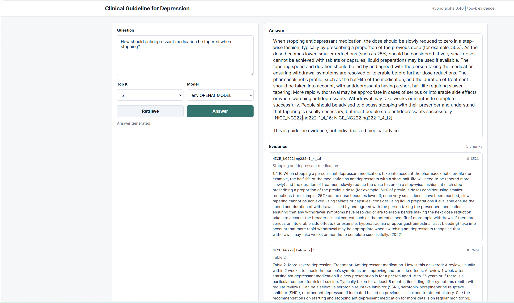

# Clinical Guideline RAG Evaluation

This repository is a completed learning-oriented RAG experiment. It was built to learn and evaluate core retrieval-augmented generation components over a single clinical guideline source, not to create a production clinical assistant.

The project uses NICE NG222, *Depression in adults: treatment and management*, as a compact test corpus for studying:

- guideline chunking
- lexical retrieval with BM25
- local embedding retrieval
- hybrid retrieval
- retrieval evaluation with manually labelled gold chunks
- evidence-grounded answer generation as a qualitative demo

## Final Status

The retrieval experiment is complete for the current scope.

Completed components:

- Raw NG222 HTML and PDF snapshots are stored under `data/raw/ng222/`.
- Recommendation chunks are generated from the NG222 recommendations HTML.
- Table 1 and Table 2 treatment-option rows are generated from the same HTML snapshot.
- A reproducible combined chunk file is available at `data/processed/ng222_chunks_with_tables.jsonl`.
- BM25, local embedding, and hybrid retrieval were implemented and compared.
- All retrieval methods were evaluated on the same 29-query manually labelled evaluation set.
- Retrieval reports and per-query comparison files are stored under `reports/` and `data/eval/results/`.
- API-backed answer generation and a local browser UI are included as optional qualitative demonstrations.

## Project Positioning

This project is:

- a learning project for understanding practical RAG pipelines
- a small retrieval benchmark over one clinical guideline
- a comparison of BM25, local embedding, and hybrid retrieval
- a prototype for evidence-grounded answer generation using retrieved guideline chunks

This project is not:

- a production clinical assistant
- a medical decision-support system
- a clinically validated tool
- a replacement for professional clinical judgement
- a system for individualized medical advice

The quantitative part of the project evaluates retrieval only. The LLM answer generation and UI are included to demonstrate how retrieved evidence can be passed to an API model, but the generated answers are not formally evaluated.

## Corpus

The current combined corpus is:

```text
data/processed/ng222_chunks_with_tables.jsonl
```

It contains:

- 137 recommendation chunks
- 21 table-row chunks
- 158 chunks total

Build recommendation-only chunks:

```powershell
python scripts\build_chunks_ng222.py
```

Build recommendation plus table chunks:

```powershell
python scripts\build_chunks_ng222_with_tables.py
```

## Evaluation Set

The shared retrieval evaluation set is:

```text
data/eval/ng222_bm25_eval_questions.jsonl
```

It contains 29 manually labelled English queries. Each query includes expected NG222 chunk IDs. The same evaluation set is used for:

- BM25 retrieval
- local embedding retrieval
- hybrid retrieval

This shared setup makes the retrieval comparison directly comparable across methods.

## Retrieval Results

| Method | Recall@1 | Recall@3 | Recall@5 | MRR@5 |
| --- | ---: | ---: | ---: | ---: |
| BM25 | 0.690 | 0.793 | 0.931 | 0.768 |
| Local embedding | 0.586 | 0.862 | 0.966 | 0.737 |
| Hybrid | 0.759 | 1.000 | 1.000 | 0.874 |

Main interpretation:

- BM25 is strong for exact guideline wording and clinical terms.
- Local embedding retrieval improves semantic recall but has weaker top-rank precision.
- Hybrid retrieval gives the best overall result by combining lexical precision with semantic recall.

The selected hybrid configuration is:

```text
alpha = 0.40
candidate_k = 50
```

The hybrid score is:

```text
hybrid_score = alpha * normalized_bm25_score + (1 - alpha) * normalized_embedding_score
```

## Running Retrieval Experiments

Run BM25 evaluation:

```powershell
python scripts\eval_bm25.py
```

Build the local embedding index:

```powershell
conda run -n ml python scripts\build_embeddings_ng222.py
```

Run local embedding evaluation:

```powershell
conda run -n ml python scripts\eval_embedding.py
```

Run hybrid alpha sweep:

```powershell
conda run -n ml python scripts\eval_hybrid.py
```

Compare per-query retriever behavior:

```powershell
python scripts\compare_retrievers.py
```

Key result files:

```text
data/eval/results/bm25_ng222_results.json
data/eval/results/embedding_ng222_results.json
data/eval/results/hybrid_ng222_results.json
data/eval/results/hybrid_ng222_sweep.json
data/eval/results/per_query_comparison.csv
```

## Optional API Answer Demo

API-backed answer generation is included as a qualitative demonstration only. It is not part of the quantitative retrieval evaluation.

The answer generator uses:

```text
Hybrid retrieval with alpha = 0.40
```

It retrieves top-k evidence chunks, builds an evidence block, and asks an API model to answer using only the retrieved evidence.

Set API credentials in the current PowerShell session:

```powershell
$env:OPENAI_API_KEY="your_api_key_here"
$env:OPENAI_MODEL="gpt-4.1-mini"
```

Dry-run without calling the API:

```powershell
conda run -n ml python scripts\generate_answer.py --query "How should antidepressant medication be tapered when stopping?" --dry-run
```

Generate a cited answer:

```powershell
conda run -n ml python scripts\generate_answer.py --query "How should antidepressant medication be tapered when stopping?"
```

The prompt instructs the model to:

- use only retrieved NICE guideline evidence
- cite `chunk_id` for every substantive claim
- avoid individualized medical advice
- state when retrieved evidence is insufficient

## Optional Local Web UI

The local browser UI is also a qualitative demonstration. It is intended for inspecting retrieval and trying cited answer generation interactively.

Run the UI:

```powershell
conda run -n ml python scripts\ui_server.py --port 8765
```

Then open:

```text
http://127.0.0.1:8765
```

The UI supports:

- hybrid retrieval over NG222 chunks
- optional API-backed cited answer generation
- evidence inspection with chunk IDs and hybrid scores

UI screenshot:



The UI reads API credentials only from environment variables. Do not write API keys into code, JSON files, reports, or git-tracked files.

## Reports

Detailed reports are available under `reports/`:

```text
reports/bm25_eval_report.md
reports/local_embedding_eval_report.md
reports/hybrid_eval_report.md
reports/retrieval_experiment_summary.md
```

## Limitations

This project has important limitations:

- It uses a single guideline source, NICE NG222.
- The evaluation set is small, with 29 queries.
- Gold chunks were manually labelled.
- Quantitative evaluation uses retrieval metrics only.
- Answer generation was not formally evaluated.
- The system is not clinically validated.
- The local embedding model is a general-purpose model, not a clinical-domain-specific embedding model.

## Safety Note

This project evaluates retrieval over guideline evidence. It is not designed to provide individualized medical advice.
